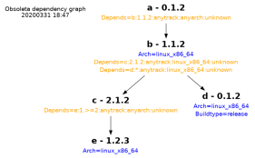

[](https://travis-ci.org/bjerrep/obsoleta)

# obsoleta

#### <center>A version checking and version resolving framework <BR> for very small development setups </center>

When there is a few developers then everything is fine up to the point where someone suggests to break the big single build up into smaller entities as build and test execution times starts to get excessive. So now you have e.g. executable **a** depending on library **b** depending on library **c**. That's a splendid idea except for the fact that just about every time someone is making breaking changes in **c** everything else is a pain. The CI might get it right every time, but fellow developers keep wasting time trying to figure out what went wrong. Too often someone updates e.g. the **a** repository alone and then have to figure out why stuff stopped working or the build breaks. Obsoleta tries to be a tool that makes it more transparent what is going on.

There are tonnes of modules, packages, whatever in the world that does the same as is done here. Probably the biggest selling point for Obsoleta is that it is very small and hopefully relatively hackable.

There are two scripts in obsoleta, obsoleta.py itself and a helper script called dixi.py and they have a chapter each. The first part below describe working with obsoleta.


## Status

This is a work in progress. The code is riddled with yet to be found subtle and not so subtle bugs and the documentation is this page that probably suffers from a lack of direction and contains information that was never or is no more the truth. But the general idea hopefully burns through. There is a test.py script in the repository - assuming that it actually executes to a pass then its tests can be used as reference.

## The metadata

Getting the trivial stuff out of the way first. From now on the **a**, **b** and **c** from above are all called packages and they will be used as the template for a small setup. A package is identified as a directory hosting a json file *obsoleta.json* containing

- a mandatory and unique name
- a mandatory version number
- an optional track (e.g. "development", "testing", "production")
- an optional arch (free form string e.g. "linux_x86_64", "windows_x86_64" etc)
- an optional buildtype (free form string e.g. "debug" or "release")
- an optional 'depends' list, listing other packages

This is how a obsoleta.json file can look like (generated with dixi.py --printtemplate):

	{
	    "name": "a",
	    "version": "0.0.0",
	    "track": "development",
	    "arch": "archname",
	    "buildtype": "buildtype",
	    "depends": [
		{
		    "name": "b",
		    "version": "0.0.0",
		    "track": "development",
		    "arch": "archname",
		    "buildtype": "buildtype"
		}
	    ]
	}

Whether or not the optional track, arch and buildtype are globally enabled is defined in a configuration file loaded by Obsoleta. Even if they are enabled they are optional in the json files which might be the reason for any small inconsistencies further down this page.

A package file can contain any custom information next to the obsoleta data which will be preserved by dixi (further down this page) when it is updating package files, and that can be queried by dixi as well if given the key. If the package file would be the right place to say keep extra information for e.g. the build system to use, then its a possibility.

### Specifying a package, 'compact name'

All the meta data for a package can be bundled into a single identifier called compact name, used both in queries and for output. For outputs it may look like these:

No optionals enabled:
**name:version**

All optionals enabled but unspecified for a given package (falling back to default values):
**name:version:anytrack:anyarch:unknown**

When everything is in use it might be something like:
**name:version:testing:linux_x86_64:release**


For querying the compact name is parsed from left to right and missing values will be substituted with a * for the version or anytrack/anyarch/unknown for the optionals. So some valid compact names in queries will be

    name
    name:version
    name:version:testing:linux_x86_64:release
    
    name::testing
    name::::release

The examples below uses the raw name since they are very simple and the name itself is enough for a unique identification.

## Example

Given one or more root directories Obsoleta recursively scans for *obsoleta.json* files (with a given limit on the number of recursions, see the depth paragraph). The directory name itself is not used by Obsoleta, the package name is always taken from the json file.
So seen from a file system view it could look like this:

	test_simple/
	├── a_master
	│   └── obsoleta.json
	├── b_bugfix
	│   └── obsoleta.json
	└── c_rubbish
	    └── obsoleta.json

The obsoleta.json files for a minimal **a**-**b**-**c** package setup could contain something like this: (truncated for brevity, this is in three separate valid json files)

	  "name": "a", "version": "0.1.2",
		  "depends": [{ "name": "b", "version": "0.1.2"  }]
	
	  "name": "b", "version": "0.1.2",
		  "depends": [{ "name": "c", "version": "0.1.2"  }]
	
	  "name": "c", "version": "0.1.2"

## Checking

Assuming the local workspace contains the package json files as above then a --check will find no problems:

	./obsoleta.py --conf mini.conf --root testdata/A2_test_simple --package a --check

The silence means that the --check was successful. 

The tree view will also show errors if there are any (which there isn't):

	./obsoleta.py --conf mini.conf --root testdata/A2_test_simple --package a --tree
	    a:0.1.2:anytrack:anyarch:unknown
	      b:0.1.2:anytrack:anyarch:unknown
	        c:0.1.2:anytrack:anyarch:unknown

The configuration file 'mini.conf' used for the examples are:

          "depth" : 4,
          "using_arch": "true",
          "using_track": "true",
          "using_buildtype": "true",
          "allow_duplicates": "false"


Now someone makes a change in **c**, refreshes the json files with new version numbers and checks in **a**, **b** and **c**. (In the following examples the package files in test/A2_test_simple are modified manually)

A colleague checks out **a** to get the latest and greatest. The json files will now contain

	  "name": "a", "version": "0.1.2",
		  "depends": [{ "name": "b", "version": "0.2.2"  }]
	
	  "name": "b", "version": "0.1.2",
		  "depends": [{ "name": "c", "version": "0.1.2"  }]
	
	  "name": "c", "version": "0.1.2"

which as might be suspected iznogood:

	./obsoleta.py --conf mini.conf --root testdata/A2_test_simple --package a --check
	    checking package "a:*:anytrack:anyarch:unknown": failed, 1 errors found
	       Package not found: b:0.2.2:anytrack:anyarch:unknown required by a:0.1.2:anytrack:anyarch:unknown

which can be seen in the tree as well

	./obsoleta.py --conf mini.conf --root testdata/A2_test_simple --package a --tree
	    package tree for "a:*:anytrack:anyarch:unknown"
	    a:0.1.2:anytrack:anyarch:unknown
	      b:0.2.2:anytrack:anyarch:unknown
	       - Package not found: b:0.2.2:anytrack:anyarch:unknown required by a:0.1.2:anytrack:anyarch:unknown

which suggests that **b** should be updated. Once that is done it will be a proper **c** that is missing.

## Resolving

It is possible to use comparison operators (> >= == <= <) for any packages listed in the depends sections. Assuming that three versions of **c** are in the filesystem it could look like this:

	  "name": "a", "version": "0.2.2",
		  "depends": [{ "name": "c", "version": "0.>=2.2"  }]
	
	  "name": "c",  "version": "0.1.2"

  	  "name": "c",  "version": "0.2.2"

  	  "name": "c",  "version": "0.3.2"

where a '--tree a' with some kind of mathematical justice returns

	./obsoleta.py --conf mini.conf --root testdata/A2_test_simple --package a --tree
	a:0.2.2:anytrack:anyarch:unknown
	  c:0.3.2:anytrack:anyarch:unknown

If using the operators (at least '>') in the compact name given with the --package switch then remember to use "" around the compact name. The shell used might decide that it should start to redirect things and that makes for some unexpected results.

### Keepgoing

By default obsoleta makes a full scan and a full resolve of everything at each invocation. The upside is that if it doesn't complain then everything should be in working order in all scanned packages and every operation is good to go. The downside is that a rogue package for say for an architecture for which you couldn't care less now can make the whole thing fall apart. For this there is a --keepgoing option that ignores unresolvable packages so the only errors encountered will be if the current operation is actually impossible to resolve. A default keepgoing value can be set in the configuration file (see obsoleta.conf.template) and a --keepgoing argument will overrule it.


## Track, Arch & Buildtype

### Track

The track is used to add release management life cycles into the mix. The allowed tracks are currently arbitrarily hardcoded as a.o. 'anytrack', 'development', 'testing' and 'production'. The catch is that they introduce a binding where pulled in packages need to be at the same track or better than the parent.

	  "name": "a", "version": "0.1.2",
		  "depends": [{ "name": "b", "version": "0.1.2"  }]
	
	  "name": "b", "track" : "testing", "version": "0.1.2"

This is ok, **b** will be picked up:

	./obsoleta.py --conf mini.conf --root testdata/A2_test_simple --package a --tree
	a:0.1.2:anytrack:anyarch:unknown
	  b:0.1.2:testing:anyarch:unknown

But this:

	  "name": "a", "track": "testing", "version": "0.1.2",
		  "depends": [{ "name": "b", "version": "0.1.2"  }]
	
	  "name": "b", "track" : "development", "version": "0.1.2"

is not legal:

	./obsoleta.py --conf mini.conf --root testdata/A2_test_simple --package a --tree
	a:0.1.2:testing:anyarch:unknown
	  b:0.1.2:testing:anyarch:unknown
	   - Package not found: b:0.1.2:testing:anyarch:unknown required by a:0.1.2:testing:anyarch:unknown

Complaining about the package b:0.1.2:testing:anyarch:unknown which is a dummy constructed for the occasion might not be the best way to convey the problem but that's the way it is right now. Also the valid track names are currently hardcoded in the python script which is not the way it should be.

### Arch

The arch (architecture) attribute acts as an appendix to the name so e.g. a library can coexist in multiple flavors for the otherwise same name, version, track and buildtype.

The default arch name is 'anyarch' which as the name suggests matches any architecture. This perhaps unfortunately gives it kind of two different meanings when dealing with packages producing binaries: The first would be that only one architecture is ever used and no packages bother to define an "arch" attibute and everything then just gets 'anyarch'. The other meaning would be in a multi arch setup where a package using 'anyarch' would be a package without binaries, e.g. a tool/utility package or perhaps an include file only package for c/c++.


### Buildtype

Buildtype is ignored except for the track 'production' where it is illegal to mix different buildtypes. This is a somewhat debatable implementation and it might not hold in the real world.

## Search roots

Obsoleta will use current working directory as default search root if nothing else is explicitly given. Search roots can be specified on the command line using '--root' and/or in the configuration file and/or by the environment variable OBSOLETA_ROOT if given. All paths are concatenated to a single list which is traversed at each invocation (see also [caching](#caching)). The configuration file have a 'paths' which is just a json array, and a 'env_paths' string which is shell expanded (it can contain environment variables in $ style). Both '--path' and 'env_paths' can be : separated lists.

The environment variable OBSOLETA_ROOT is intended to be a last resort solution if say e.g. a specific buildserver has a non standard layout compared to what obsoleta default is configured to use.

## Slots/multislots

Slot and multislots are a way to deal with the fact that once the 'arch' attibute is actually used for different architectures then the straight forward package files used so far on this page won't cut it.

### Slots

A use case could be that a developer working on multiple architectures decides to check out the same repository once for each architecture. This could lead to the following file structure:

    ├── a_x86/
    │   ├── obsoleta.json
    │   └── obsoleta.key
    └── a_x86_64/
        ├── obsoleta.json
        └── obsoleta.key


This will result in the same obsoleta.json file (from the SCM) in multiple directories and obsoleta will complain about duplicate packages.

The current solution is to add a new file alongside obsoleta.json called obsoleta.key defining the so-called slot that the current directory represents. This key file should then -not- be in the SCM. How the key file is made say by a CI that is about to make a clean rebuild should be implemented in the local toolchain. A slotted obsoleta.json and a matching key file could look like

**obsoleta.json**

	{
	  "slot": {
	    "name": "b",
	    "version": "0.1.2"
	  },
	  "key1": {
	    "arch": "x86_64"
	  },
	  "key2": {
	    "version": "0.1.3",
	    "arch": "x86"
	  }
	}

**obsoleta.key**

	{
	  "key": "key2"
	}

What happens is that the package definition used by obsoleta will be the 'slot' dictionary with additions or rewrites from the given slot. From the above this will yield

	{
	    "name": "b",
	    "version": "0.1.3",
	    "arch": "x86"
	}

### Multislots

If building for multiple architectures is done out-of-source in a single directory it could look like this:

    a/
    ├── obsoleta.json
    ├── build_x86/
    │   └── obsoleta.key
    └── build_x86_64/
        └── obsoleta.key

So compared to the slot version above there will now have to be multiple key files, one in each build directory, where all are referring to the same package file. The only difference to the slot section above is that the base key is now called "multislot" rather than just "slot" in the package file.

### Blacklisting and skipping

There are three ways to tell obsoleta to ignore a directory (and any subdirectories) even if there are otherwise valid obsoleta files present.

The simplest one is to add a 'obsoleta.skip' file in any directories that should be ignored.

Alternatively to what might end up as littering skip files throughout the filestructure there is a 'blacklist_paths' entry in the configuration file and a --blacklist_path command line argument. They are joined to one list and are both used.

### Search depth

The default recursive scan depth relative to the specified root directories are 1. It can be changed on the command line with --depth and/or it can be defined in the configuration file with a "depth" entry. A command line depth number overrules any configuration depth number.

## Semantic versioning

If having 3 numbers in the version number is considered good enough, then yes. The real answer is no, for no other reason that support for semantic versioning haven't been implemented since just about everything seemed more interesting to do at any given time. There is however a 'semver' setting in the configuration file which enforces the requirement that lower version numbers should be implicitly reset whenever a major or minor number is increased. Which makes perfect sense and was simple to add.


## Build support

The examples above are most of all just intellectual exercises until the information can be used for actual building. For this there is a --buildorder option which does pretty much what it says:

	./obsoleta.py --conf mini.conf --root testdata/A2_test_simple --package a --buildorder
	c:0.1.2:anytrack:anyarch:unknown
	b:0.1.2:anytrack:anyarch:unknown
	a:0.1.2:anytrack:anyarch:unknown

For automation the paths are more interesting and can be listed using --printpaths:

	./obsoleta.py --conf mini.conf --root testdata/A2_test_simple --package a --buildorder --printpaths
	/home/obsoleta/src/obsoleta/test/A2_test_simple/c
	/home/obsoleta/src/obsoleta/test/A2_test_simple/b
	/home/obsoleta/src/obsoleta/test/A2_test_simple/a

Conceptually there isn't a long way to a pseudo script that could wrap everything up:

	for path in "--path testdata/test_simple --package all --buildorder --printpaths"
		cd path
		git pull
		export obsoleta=$obsoleta:path # for the build system to use
		./build.sh

### List missing packages

The underlying theme for most of this readme is the expectation that the workspace is in working order and is ready to be used. It might however also be a common use case that old and/or specialized builds are brought back to life where the dependencies are expected to be more or less missing in the local workspace and should be reinstalled for the occasion.

For this there is an command called --listmissing which will simply list any missing dependencies for a given package without the usual error messages and exitcodes associated with a broken tree. It could look like this:

```
./obsoleta.py --conf mini.conf --root testdata/E1_list_missing_packages --package a --listmissing
b:1.1.1:anytrack:c64:unknown
e:1.1.1:anytrack:c64:unknown
```

With a little script wizzardry **b** and **e** could now be checked out from the scm at the tags 1.1.1 and get a obsoleta.key file setting the arch to c64. This cycle would then have to be repeated until the --listmissing command returns a blank. Then a --buildorder will tell in which order to build the dependencies. Alternatively it might be that some or all of the missing dependencies should be installed from binary releases from an artifact server of some kind instead. You would be the one knowing how to do that.


## Python api

The inner obsoleta workings happens in 'obsoletacore.py' and 'obsoleta.py' is just a wrapper script with command line parsing. The Obsoleta python class (in obsoletacore) does not make a virtue of consistency in its methods, and it might be a bad idea to rely on its inner workings. There is a 'pythonapi.py' which provides a wrapper class with slightly more meaningfull names and a slightly more consistent api. An usage example could be something like:

    my_root = 'test/G2_test_slot'
    
    args = Args()
    args.set_info(True)
    args.set_root(my_root)
    
    obsoleta_api = ObsoletaApi("mini.conf", args)
    
    success, messages = obsoleta_api.check('e')

When several operations are performed on the same obsoleta object then there is an obvious gain as the full root scan is only made once. The ObsoletaApi wrapper is tested in test_obsoleta_api.py.

There is the start of a dixi_api and test_dixi_api as well.

## Caching

Caching can be enabled by "cache": "on" in the configuration file. If caching is enabled then obsoleta will make the full scan only if there is no cache to be found and it will then write the cachefile. The cache can be cleared by calling obsoleta.py with --clearcache or the cache file can simply be deleted. The cache file is located as ./local/obsoleta.cache.

Caching will make sense in a scenario where a build system ends up calling obsoleta from different scripts and where the performance hit starts to get noticable. And even then the decision has to be between enabling caching or just making obsoleta run faster. Also notice that since there is only a single central cache file, caching might act funny on a build server with concurrent builds.

The cache file is a pretty printed json file and it might give some interesting insights since it summarizes the whole  scan in a single file. It is possible to generate it explicitly regardless of whether caching is enabled or not:

        ./obsoleta.py --conf mini.conf --root testdata/A1_test_obsoleta:. --depth 1 --dumpcache
        [
            {
                "name": "obsoleta",
                "version": "0.1.0",
                "path": "/home/user/src/obsoleta"
            },
            {
                "name": "testsuite",
                "version": "0.0.0",
                "path": "/home/user/src/obsoleta/testdata/A1_test_obsoleta",
                "depends": [
                    {
                        "name": "obsoleta",
                        "version": "0.1.0",
                        "path": "/home/user/src/obsoleta"
                    }
                ]
            }
        ]

# dixi

dixi is a utility script intended to make usage easier for both a CI and developers when scripting. The purpose of dixi is that it shouldn't normally be required to edit the json package files manually once they are made and it intends to provide an easy interface for manipulating a package file. Dixi always works on a uniquely specified package file and never tries to figure out in what contexts the given package is used as opposed to the obsoleta script.

Currently dixi supports the following get/set operations:

	--getname
	--getversion
	--setversion x.y.z
	--incmajor
	--incminor
	--incbuild
	--setmajor x
	--setminor y
	--setbuild z
	--gettrack
	--settrack track
	--getarch
	--setarch arch
	--getbuildtype
	--setbuildtype buildtype

Run ./dixi.py --help to get the current list of commands and optional modifiers that can be used for tweaking some of the commands.

There are also the free form get/setters of key:values external to obsoleta:

	--getvalue key
	--setvalue "key this is the value"

Use the get/setters in the first part for obsoleta specific entries, the free form get/setters for anything else (e.g. a toolchain that might decide the obsoleta.json files is a good place to save information in)


An simple dixi example:

    ./dixi.py --conf mini.conf --path testdata/A2_test_simple/a --getversion
    0.1.2

Another operation is to print a template package file using the argument '--printtemplate' as it was shown above somewhere.

Dixi can also print the merged version of a slotted or multislotted package file if told which key to use. It might be handy if e.g. obsoleta is suspected to do a bad merge. An example:

    ./dixi.py --conf mini.conf --path testdata/G1_test_multislot/b_multi_out_of_source --keypath build_linux --print
    {
        "name": "b",
        "version": "1.1.1",
        "arch": "linux",
        "depends": [
            {
                "name": "c",
                "version": "2.2.2",
                "arch": "linux"
            }
        ]
    }

Dixi can also generate a slot/multislot key file intended to be redirected to a obsoleta.key file:

    /dixi.py --printkey key:value
    {
        "key": "value"
    }

# Bump

A bump is the operation of updating the version for a given package anywhere it is found, in both  downstream and upstream packages.  Its a crossover between using obsoleta to find something and dixi to modify or query it. Since it therefore doesn't belong as a command in either, but should be in one anyway, it for now exists as an command for obsoleta as the --bump command with a mandatory --version argument.

Lets try it out. Copy the contents from *testdata/F2_test_duplicate_package_slotted_ok* to *local/temp* in order not to mess with the original testdata.

Check that the x86 arch is ok (in this testset there is a x86_64 arch which is missing a 'b'):

`./obsoleta.py --conf testdata/test.conf --root local/temp --check --package a:::x86`

Due to the absence of complaints it is. Now bump b for arch x86:

`/obsoleta.py --conf testdata/test.conf --root local/temp --bump --package b:::x86 --version 7.9.13`

which gives

`bumped upstream {b:2.1.2:development:x86:unknown} from 2.1.2 to 7.9.13 in "b"`

`bumped downstream {b:2.1.2:development:x86:debug} from 2.1.2 to 7.9.13 in "a2"`

Sounds about right. A new --check will tell that the x86 arch still adds up . And the version of 'b' from above is now:

`./dixi.py --conf testdata/test.conf --path local/temp/b --getversion`

`7.9.13`

If a package should be bumped for all architectures for which it is found the arch can be specified as "all". This is a special arch keyword dedicated to --bump. The compact name will then be name:::all.

# Generators

Dixi has experimental support for auto generating C source files making it possible to add runtime version checking to a C/C++ based system. More [here](GENERATORS.md)


# Graph

Also from the exotic department obsoleta can be told to make a graphviz dependency graph with the command --digraph. An example:

`./obsoleta.py --conf testdata/test.conf --root testdata/A2_test_simple/ --package a --digraph`

This will produce an 'a.gv' file that can be converted to a .png with: 
`dot -Tpng a.gv -o depgraph.png`

Which currently looks like this: (click to expand)

[](depgraph.png)


